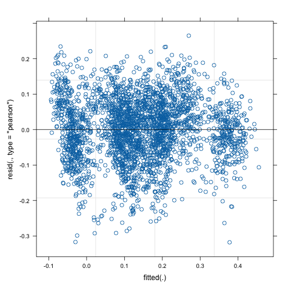
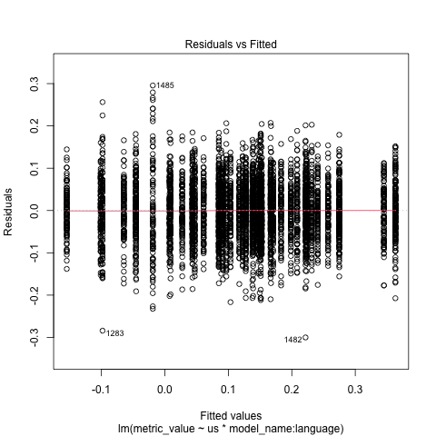

Here’s your section reformatted into clean, publication-style Markdown:

---

## Regression Assumption Checks and Coefficient Tables

This section contains both the raw regression coefficient tables and assumption checks for the two regression models.

### Assumption Checks

#### RQ1 – LMER Model

For the LMER model in RQ1, the main important check is that residuals are randomly distributed ([Schielzeth et al., 2020](https://doi.org/10.1111/2041-210X.13434)).
Since we have a fairly large dataset, the model is relatively robust to other measures, and numeric statistical tests would be too sensitive for practical use ([Gigerenzer, 2024](https://doi.org/10.1016/j.socec.2004.09.033)).
The residuals can be seen in **Figure 1a**, which clearly shows randomly distributed residuals.

#### RQ2 – Linear Model

A similar exercise can be done for the linear model in RQ2 (see **Figure 1b**). Similarly to RQ1, the residuals here are also normal and randomly distributed.

Given the above checks, we conclude that the relevant assumptions for our regressions hold.

The full regressionstable can be found by following the links below: 
- [Multilingual vs Multicultural (RQ1)](./regressions/multilingual_regression_results_interaction.txt)
- [US-centric bias](./regressions/us_centric_bias_regression_results_normal.txt)
---

### Figures

**Figure 1 — Residual plots showing model diagnostics for RQ1 and RQ2**

| (a) Randomly distributed residuals for RQ1                            | (b) Residuals for the regression in RQ2                           |
| --------------------------------------------------------------------- | ----------------------------------------------------------------- |
|  |  |

---
